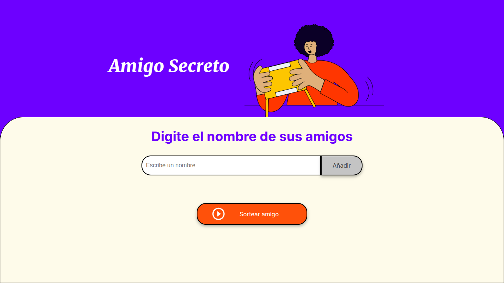
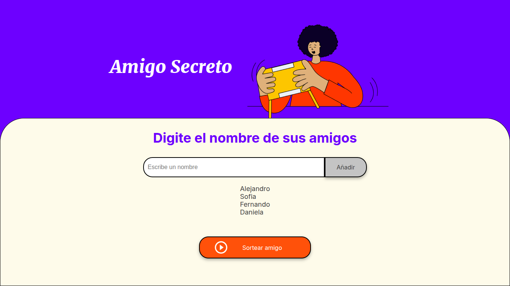
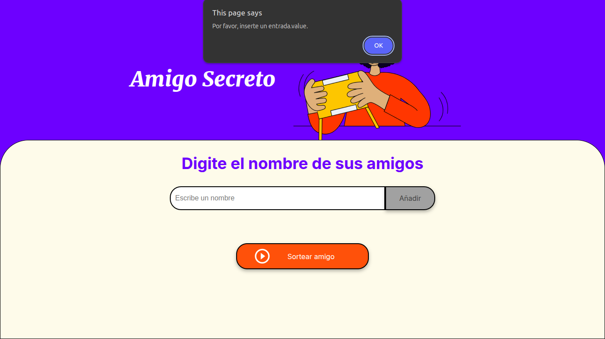
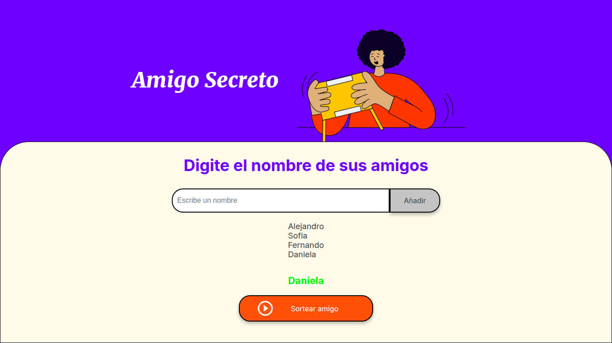

# Challenge-amigo-secreto Alura

Una pagina web que puedes usar para jugar al amigo secreto.



## Funcionalidades ⚙️

### Agrega nombres a la lista

Puedes presionar el botón añadir para agregar el nombre a la lista y la entrada se limpiara automaticamente.



Asegúrate de no dejar el campo vació o podrá aparecer un mensaje de error.



Finalmente puedes sortear un amigo y ver quien te toco.



## Comenzando 🚀

Sigue estos pasos para empezar a usar la aplicación.

### Pre-requisitos 📋

Necesitaras un navegador web como Chrome o Firefox.

### Instalación 🔧

Clona el repositorio.

```
git clone https://github.com/alep-m/challenge-amigo-secreto.git
```

Para ejecutar solo abre el archivo HTML en un navegador web.

## Construido con 🛠️

* JavaScript
* HTML
* CSS